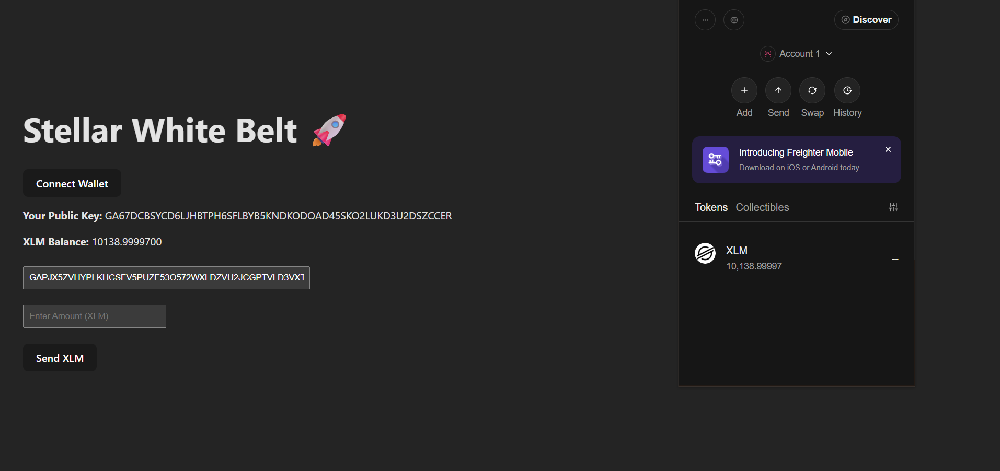
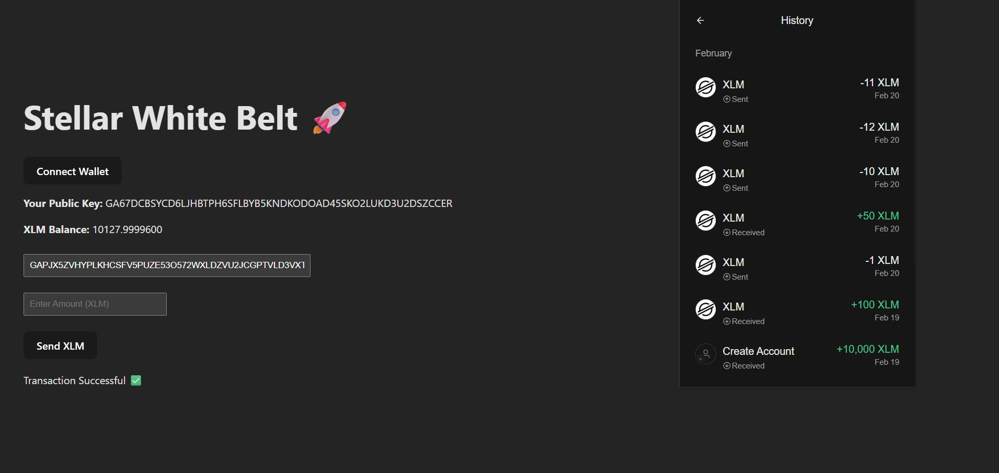

# 🚀 Stellar White Belt Project

## 📌 Project Title

Stellar Wallet Integration & XLM Transaction

---

## 📖 Description

This project is a simple decentralized application (DApp) built using React and Stellar blockchain.
It connects with the Freighter Wallet, fetches account details, and allows users to send XLM transactions on the Stellar Testnet.

---

## ✨ Features

* 🔗 Connect Freighter Wallet
* 🪪 Display Public Key
* 💰 Fetch XLM Balance
* 💸 Send Custom XLM Transaction
* ✅ Show Transaction Status (Success / Failed)

---

## 🛠️ Tech Stack

* React (Vite)
* JavaScript
* Stellar SDK (@stellar/stellar-sdk)
* Freighter Wallet (@stellar/freighter-api)
* Horizon API (Testnet)

---

## ⚙️ Setup Instructions

### 1️⃣ Clone the repository

git clone https://github.com/harshaljagdale0222/stellar-white-belt.git

---

### 2️⃣ Navigate to project folder

cd stellar-white-belt

---

### 3️⃣ Install dependencies

npm install

---

### 4️⃣ Run the project

npm run dev

---

### 5️⃣ Open in browser

http://localhost:5173/

---

## 📸 Screenshots

### 🔹 Wallet Connected & Balance

---

### 🔹 Transaction Success

---

### 🔹 Wallet Proof

---

## 🎯 Output

* Wallet successfully connected ✅
* Public key displayed ✅
* XLM balance fetched from Stellar Testnet ✅
* Transaction successfully sent ✅
* Transaction status displayed in UI ✅

---

## 📌 How It Works

1. User clicks **Connect Wallet**
2. Freighter Wallet popup appears
3. Public key is fetched from wallet
4. Horizon API fetches account balance
5. User enters amount and destination
6. Transaction is signed via Freighter
7. Transaction is submitted to Stellar network

---

## 📌 Conclusion

This project demonstrates how to integrate a blockchain wallet with a frontend application and perform real-time transactions using the Stellar network.

---

## 👨‍💻 Author

Harshal Jagdale
